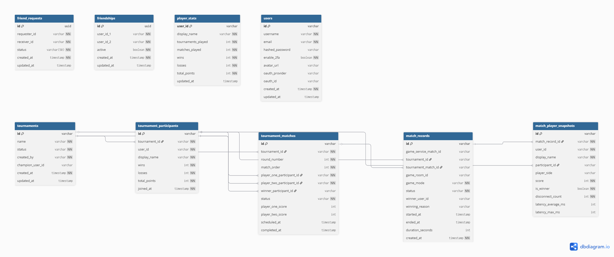

_This project has been created as part of the 42 curriculum by [aldantas](https://profile-v3.intra.42.fr/users/aldantas), [dbessa](https://profile-v3.intra.42.fr/users/dbessa), [jveras](https://profile-v3.intra.42.fr/users/jveras), [lraggio](https://profile-v3.intra.42.fr/users/lraggio) e [marcribe](https://profile-v3.intra.42.fr/users/marcribe)_

# Description
## Tic Tac Infinity
This section have to clearly presents the project, its goal and brief overview.

# Instructions

## Prerequisites

The following tools must be installed before running the project:

| Tool | Purpose | Install |
|------|---------|---------|
| **Docker & Docker Compose** | Container runtime for all services | [docs.docker.com](https://docs.docker.com/get-docker/) |
| **Make** | Build automation | `brew install make` / `apt install make` |
| **MkCert** | Local SSL certificate generation | `brew install mkcert` / `apt install mkcert` |

After installing MkCert, install the local CA:
```bash
mkcert -install
```

## Environment Configuration

1. Copy the example environment file:
   ```bash
   cp .env.example .env
   ```

2. Fill in the required values in `.env`:

   | Variable | Description |
   |----------|-------------|
   | `POSTGRES_USER` / `POSTGRES_PASSWORD` / `POSTGRES_DB` | PostgreSQL credentials |
   | `REDIS_URL` | Redis connection URL |
   | `JWT_SECRET` | Secret key for JWT signing |
   | `JWT_ALGORITHM` | JWT algorithm (e.g. `HS256`) |
   | `JWT_EXPIRES_MINUTES` | Token TTL in minutes |
   | `JWT_ISSUER` | JWT issuer identifier |
   | `SMTP_HOST` / `SMTP_PORT` / `SMTP_USER` / `SMTP_PASSWORD` / `SMTP_FROM_EMAIL` | Email (SMTP) credentials |
   | `ELASTIC_PASSWORD` | Elasticsearch password |
   | `MINIO_ROOT_USER` / `MINIO_ROOT_PASSWORD` | MinIO object storage credentials |
   | `GRAFANA_ADMIN_USER` / `GRAFANA_ADMIN_PASSWORD` | Grafana dashboard credentials |

3. Generate SSL certificates:
   ```bash
   make certs
   ```

## Running the Project

### Development (local)
```bash
make all
```

### Production (Docker)
```bash
make deploy
```

### Stopping & Cleanup
```bash
make down    # Stop all services
make clean   # Stop and remove all volumes (full reset)
```

### Other Useful Commands
```bash
make logs    # Stream container logs
make tests   # Run test suite (requires UV installed locally)
make lint    # Lint Python services
make format  # Format Python services
```

## Accessing the Application

Once running, services are available at:

| Service | URL |
|---------|-----|
| **Frontend** | https://localhost |
| **Grafana** | https://localhost/grafana |
| **Kibana** | https://localhost/kibana |
| **Prometheus** | https://localhost/prometheus |
| **MinIO Console** | http://localhost:9001 |

# Resources

## Documentation & References

### Frontend
- [React Documentation](https://react.dev/)
- [TypeScript Documentation](https://www.typescriptlang.org/docs/)
- [Vite Documentation](https://vitejs.dev/guide/)
- [Tailwind CSS Documentation](https://tailwindcss.com/docs)
- [Bun Documentation](https://bun.sh/docs)

### Backend
- [FastAPI Documentation](https://fastapi.tiangolo.com/)
- [SQLAlchemy Documentation](https://docs.sqlalchemy.org/)
- [Go Documentation](https://go.dev/doc/)
- [Gorilla WebSocket](https://pkg.go.dev/github.com/gorilla/websocket)
- [Elixir Documentation](https://elixir-lang.org/docs.html)
- [Quarkus Documentation](https://quarkus.io/guides/)

### Infrastructure & DevOps
- [Docker Documentation](https://docs.docker.com/)
- [Nginx Documentation](https://nginx.org/en/docs/)
- [PostgreSQL Documentation](https://www.postgresql.org/docs/16/)
- [Redis Documentation](https://redis.io/docs/)

### Monitoring & Observability
- [Elasticsearch Documentation](https://www.elastic.co/guide/en/elasticsearch/reference/current/index.html)
- [Logstash Documentation](https://www.elastic.co/guide/en/logstash/current/index.html)
- [Kibana Documentation](https://www.elastic.co/guide/en/kibana/current/index.html)
- [Prometheus Documentation](https://prometheus.io/docs/)
- [Grafana Documentation](https://grafana.com/docs/grafana/latest/)

### Security
- [MkCert - Local HTTPS](https://github.com/FiloSottile/mkcert)
- [OAuth 2.0 with GitHub](https://docs.github.com/en/apps/oauth-apps/building-oauth-apps/authorizing-oauth-apps)
- [JSON Web Tokens (JWT)](https://jwt.io/introduction)

## AI Usage

AI tools were used during the development of this project as a productivity aid. Below is a summary of how and where they were applied:

| Task | AI Tool | Description |
|------|---------|-------------|
| **Code assistance** | Claude (Anthropic) | Used for debugging, code suggestions, and understanding framework-specific patterns across multiple languages (Python, Go, Elixir, Java, TypeScript) |
| **Frontend styling** | Claude Code | Assisted with CSS/Tailwind responsive layout fixes and component styling adjustments |
| **Documentation** | Claude Code | Helped draft and structure sections of this README |
| **Configuration** | Claude Code | Assisted with Docker Compose and Nginx configuration files |

All AI-generated code was reviewed, tested, and validated by team members before being merged. The team maintained full ownership and understanding of the codebase — AI was used as an accelerator, not a replacement for engineering decisions.

# Team Information
### aldantas
```
Roles
- Tech Lead
- Developer

Responsabilities
- Resp1
- Resp2
```

### dbessa
```
Roles
- Project Manager
- Developer

Responsabilities
- Resp1
- Resp2
```

### jveras
```
Role
- Developer

Responsabilities
- Resp1
- Resp2
```

### lraggio
```
Roles
- Product Owner
- Developer

Responsabilities
- Resp1
- Resp2
```

### marcribe
```
Role
- Developer

Responsabilities
- Resp1
- Resp2
```

# Project Management
We used GitHub Projects with a Kanban board to manage our workflow, incorporating key Scrum ceremonies such as sprint planning and review sessions.

At the start of the project, we outlined the majority of the tasks upfront and added new ones as needs arose. Task assignment was handled on demand — whenever a team member was available, they would pick up the next task without any rigid distribution process.

We held weekly meetings on Discord to align on next steps and priorities, while day-to-day communication happened through our WhatsApp group.

# Technical Stack

## Frontend
- **React 19** with **TypeScript** — component-based UI with type safety
- **Tailwind CSS** — utility-first CSS framework for rapid, consistent styling
- **React Router DOM** — client-side routing and navigation
- **Vite** — fast development server and optimized production builds
- **Bun** — high-performance JavaScript runtime and package manager

## Backend
- **Python FastAPI** — User Management and Tournament services. Chosen for its async support, automatic API documentation, and team familiarity
- **Go** — Game Service. Chosen for its efficient concurrency model and low-latency WebSocket handling via Gorilla WebSocket
- **Elixir (Plug/Cowboy)** — Email Service. Chosen for its fault-tolerant, concurrent architecture ideal for message processing
- **Java Quarkus** — Friends Service. Chosen for its fast startup, low memory footprint, and mature ORM ecosystem (Hibernate Panache)

## Database
- **PostgreSQL 16** — primary relational database shared across services. Chosen for its reliability, strong SQL compliance, and excellent support for concurrent access across multiple microservices
- **Redis 7** — in-memory data store used for caching and session management. Chosen for its speed and simplicity in handling ephemeral data
- **Elasticsearch 9** — used for centralized log storage and indexing as part of the ELK stack
- **MinIO** — S3-compatible object storage for user-uploaded assets (avatars). Chosen as a self-hosted alternative to cloud storage

## Other Significant Libraries
- **SQLAlchemy** (Python) and **Hibernate ORM Panache** (Java) — ORM layers for database access
- **Gorilla WebSocket** (Go) — real-time game communication
- **Swoosh** (Elixir) — email delivery abstraction
- **PyJWT** + **Passlib/bcrypt** — JWT authentication and password hashing
- **Flyway** (Java) — database migration management
- **Pydantic** (Python) — request/response validation

## Infrastructure & Observability
- **Docker & Docker Compose** — containerization and orchestration of all services
- **Nginx** — reverse proxy, SSL termination, and static file serving
- **Prometheus** + **Grafana** — metrics collection and dashboard visualization
- **ELK Stack** (Elasticsearch, Logstash, Kibana) — centralized logging and log analysis

## Justification for Major Technical Choices
The microservices architecture allowed each service to be built with the language best suited for its domain: Go for real-time game performance, FastAPI for rapid API development, Elixir for resilient message handling, and Quarkus for a lightweight Java service. PostgreSQL was chosen as the single database engine to simplify infrastructure while still supporting all services reliably. Docker was essential to unify the multi-language stack into a consistent, reproducible deployment.

# Database Schema


# Feature list
Complete list of implemented features.
Which team member(s) worked on each feature.
Brief description of each feature’s functionality.

# Modules

```
Major: Use a framework for both the frontend and backend.
◦ Use a frontend framework (React, Vue, Angular, Svelte, etc.).
◦ Use a backend framework (Express, NestJS, Django, Flask, Ruby on Rails, etc.).
◦ Full-stack frameworks (Next.js, Nuxt.js, SvelteKit) count as both if you use both their frontend and backend capabilities.
```
Why this module?

R: `To faster development using well-knwon and tested market frameworks`

How it was implemented?

R: `In frontend we've used React and for backend we've used Java Quarkus for friends-service, Mix for email-service and Python FastAPI for tournament-service and usermanagement-service`

Who implemented?

R: `Front end was implemented by both dbessa and jveras, while Backend was implemented by aldantas, lraggio and marcribe. All the integrations was made by the whole team`

***

```
Major: Implement real-time features using WebSockets or similar technology.
◦ Real-time updates across clients.
◦ Handle connection/disconnection gracefully.
◦ Efficient message broadcasting.
```
Why this module?

R: `This module is required to us successfully implement a real time game.`

How it was implemented?

R: `|`

Who implemented?

R: `aldantas`

***

```
Major: A public API to interact with the database with a secured API key, rate
limiting, documentation, and at least 5 endpoints:
◦ GET /api/{something}
◦ POST /api/{something}
◦ PUT /api/{something}
◦ DELETE /api/{something}
```
Why this module?

R: `|`

How it was implemented?

R: `|`

Who implemented?

R: `aldantas, dbessa`

***

```
Minor: Use an ORM for the database.
```
Why this module?

R: `|`

How it was implemented?

R: `|`

Who implemented?

R: `aldantas, veras`


***

```
Major: Standard user management and authentication.
◦ Users can update their profile information.
◦ Users can upload an avatar (with a default avatar if none provided).
◦ Users can add other users as friends and see their online status.
◦ Users have a profile page displaying their information.
```
Why this module?

R: `|`

How it was implemented?

R: `|`

Who implemented?

R: `aldantas, dbessa`


***

```
Minor: Implement remote authentication with OAuth 2.0 (Google, GitHub, 42, etc.).
```
Why this module?

R: `Make the acess easy has the purpose to make old users do sign in faster and new users to enter the application easily, lowering the drop rates.`

How it was implemented?

R: `We've implemented via Github OAuth. We created the OAuth app at github, setted the homepage and callback page at github and then implemented in the frontend.`

Who implemented?

R: `dbessa`


***

```
Minor: Implement a complete 2FA (Two-Factor Authentication) system for the users.
```
Why this module?

R: `|`

How it was implemented?

R: `|`

Who implemented?

R: `aldantas`

***

```
Major: Implement a complete web-based game where users can play against each other.
◦ The game can be real-time multiplayer (e.g., Pong, Chess, Tic-Tac-Toe, Card games, etc.).
◦ Players must be able to play live matches.
◦ The game must have clear rules and win/loss conditions.
◦ The game can be 2D or 3D.
```
Why this module?

R: `Since the old transcendence was made to build a Pong Game and in the new we have the flexibility to choose, we've decided to keep doing a game and choose the Tic Tac Toe with a few differences`

How it was implemented?

R: `|`

Who implemented?

R: `aldantas, dbessa, jveras, lraggio, marcribe`

***

```
Major: Remote players — Enable two players on separate computers to play the
same game in real-time.
◦ Handle network latency and disconnections gracefully.
◦ Provide a smooth user experience for remote gameplay.
◦ Implement reconnection logic.
```
Why this module?

R: `|`

How it was implemented?

R: `|`

Who implemented?

R: `aldantas`

***

```
Major: Infrastructure for log management using ELK (Elasticsearch, Logstash,
Kibana).
◦ Elasticsearch to store and index logs.
◦ Logstash to collect and transform logs.
◦ Kibana for visualization and dashboards.
◦ Implement log retention and archiving policies.
◦ Secure access to all components.
```
Why this module?

R: `|`

How it was implemented?

R: `|`

Who implemented?

R: `jveras, lraggio`

***

```
Major: Monitoring system with Prometheus and Grafana.
◦ Set up Prometheus to collect metrics.
◦ Configure exporters and integrations.
◦ Create custom Grafana dashboards.
◦ Set up alerting rules.
◦ Secure access to Grafana.
```
Why this module?

R: `|`

How it was implemented?

R: `|`

Who implemented?

R: `jveras, lraggio`

***

```
Major: Backend as microservices.
◦ Design loosely-coupled services with clear interfaces.
◦ Use REST APIs or message queues for communication.
◦ Each service should have a single responsibility.
```
Why this module?

R: `This is the right approach for our context. Using microservices allow us to pick the right tool for each service. Usermanagement and Tournament services we have chosen FastAPI for better team development, since is a common known framework. For the game we've chosen Go since it has a high-speed networking and work with thread efficiently. The loosely-coupled services helped us to deliver a good final product.`

How it was implemented?

R: `We've separated each service inside the backend folder and picked the right language for each service we wanted.`

Who implemented?

R: `aldantas, marcribe`

***

```
Minor: Support for additional browsers.
◦ Full compatibility with at least 2 additional browsers (Firefox, Safari, Edge, etc.).
◦ Test and fix all features in each browser.
◦ Document any browser-specific limitations.
◦ Consistent UI/UX across all supported browsers.
```
Why this module?

R: `It was another easy win. We focused our development in Google Chrome. And then we saw that all chromium based browsers are compatible with our application`

How it was implemented?

R: `Implemented with our normal development flow.`

Who implemented?

R: `aldantas, dbessa, jveras, lraggio, marcribe`

***

```
Minor: Custom-made design system with reusable components, including a proper
color palette, typography, and icons (minimum: 10 reusable components).
```
Why this module?

R: `Making reusable components in front end is a very productive development decision, because we can use the same element in different contexts in order to save development hours. And it is a market good practice.`

How it was implemented?

R: ``

Who implemented?

R: `dbessa, jveras`

***

```
Points calculation
2 + 2 + 2 + 1 + 2 + 1 + 1 + 2 + 2 + 2 + 2 + 2 + 1 + 1 = 23
```

# Individual Contributions
Detailed breakdown of what each team member contributed.

Specific features, modules, or components implemented by each person.
Any challenges faced and how they were overcome.
