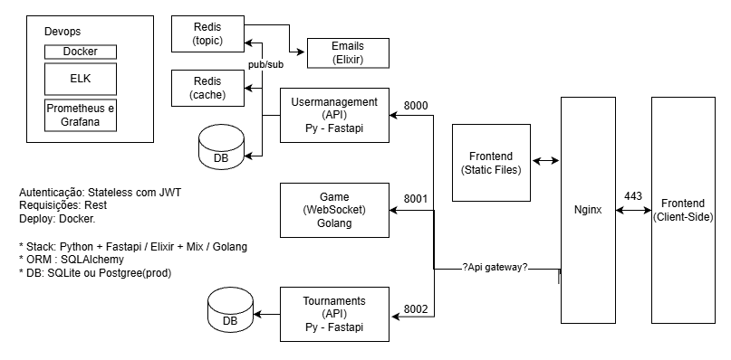

# Arquitetura do Projeto



## Visão Geral
O projeto de microserviços construído com múltiplas linguagens e frameworks, orquestrado com Docker Compose.
A arquitetura segue um padrão de API-first com separação clara de responsabilidades entre serviços especializados.

### Stack Tecnológico
- **Backend**: Python, Elixir, Go
- **Frontend**: TypeScript/React com Vite
- **Infraestrutura**: Docker, Docker Compose, Nginx
- **Autenticação**: JWT (Stateless)
- **Message Broker**: Redis (pub/sub e cache)
- **Database**: SQLite (dev), PostgreSQL (prod)
- **DevOps**: ELK Stack, Prometheus e Grafana

---

## Serviços

### 1. Usermanagement Service
**Linguagem**: Python 3.13+
**Framework**: FastAPI  
**Porta**: 8000 (interno), `/api/users/` (via Nginx HTTPS)

#### Responsabilidades
- Gerenciamento de usuários (CRUD)
- Autenticação e autorização (com base no JWT)
- Validação de email
- Hashing seguro de senhas (bcrypt)

#### Stack de Dependências
- **FastAPI**: Framework web assíncrono
- **Uvicorn**: Servidor ASGI
- **SQLAlchemy**: ORM para banco de dados
- **asyncpg**: Driver PostgreSQL assíncrono
- **aiosqlite**: Driver SQLite assíncrono
- **Redis**: Cliente para cache e eventos
- **Pydantic**: Validação de dados
- **passlib[bcrypt]**: Hashing de senhas
- **email-validator**: Validação de emails

#### Arquitetura Interna (Clean Architecture)
```
src/
├── controller/          # Camada de apresentação (Rotas FastAPI)
│
├── core/               # Configurações e utilitários
│   ├── settings.py     # Variáveis de ambiente
│   ├── exception_handlers.py  # Tratamento de exceções
│   └── utils.py        # Funções utilitárias
├── domain/             # Lógica de negócio
│   ├── models/         # Modelos de domínio
│   ├── schemas/        # DTOs
│   └── services/       # Serviços
├── infrastructure/
│   └── event_publisher.py  # Publicação de eventos
└── di_config.py        # Injeção de dependências
```

---

### 2. Emails Service
**Linguagem**: Elixir 1.14+
**Framework**: Plug (Cowboy)
**Porta**: 4001 (externo)

#### Responsabilidades
- Envio de emails assíncrono
- Subscriber de eventos Redis (pub/sub)

#### Padrão Event-Driven
O serviço de emails funciona como subscriber de eventos:
1. User Management publica evento no Redis quando usuário se registra/altera email
2. Emails Service escuta eventos no canal Redis
3. Processa e envia email

---

### 3. Game Service
**Linguagem**: Go  
**Protocolo**: WebSocket 
**Porta**: 8001

#### Responsabilidades
- Lógica principal do jogo
- Gerenciamento de salas de jogo
- Comunicação em tempo real via WebSocket
- Sincronização de estado do jogo
- Broadcast de eventos para múltiplos clientes

#### Características
- Conexões WebSocket persistentes
- Estado do jogo em memória
- Sincronização com serviço de torneios para resultados

---

### 4. Tournament Service
**Linguagem**: Python 3.13+  
**Framework**: FastAPI  
**Porta**: 8002

#### Responsabilidades
- Gerenciamento de torneios
- Sistema de matchmaking
- Persistência de resultados de partidas
- Rankings e estatísticas de jogadores
- Histórico de torneios

#### Integração
- Consome resultados do Game Service
- Publica eventos para notificações via Email Service

---

## Camada de Infra

### Nginx (Reverse Proxy)
**Porta**: 443 (HTTPS)

#### Função
- Ponto único de entrada para o frontend
- Roteamento de requisições para serviços backend
- SSL/TLS

#### Roteamento
```
https://localhost:443/
├── / → Frontend (Static Files)
├── /api/users/ → Usermanagement Service:8000
└── /api/health → Usermanagement Service:8000
```

#### Redis
1. **Cache**: Armazenamento de dados frequentemente acessados
2. **Message Broker**: Pub/Sub para comunicação entre serviços
3. **Eventos**: Stream de eventos para auditoria e logs

#### Tópicos Pub/Sub
- `user:registered` - Novo usuário registrado
- `user:updated` - Dados de usuário alterados
- `user:deleted` - Usuário removido
- `game:finished` - Partida finalizada
- `tournament:updated` - Torneio atualizado

---

## Frontend

**Tecnologia**: React + TypeScript  
**Build**: Vite  
**Porta**: 80 (interno), 443 (via Nginx)

#### Recursos
- Autenticação JWT armazenada em localStorage
- WebSocket para comunicação em tempo real do jogo

#### Integração Backend
- REST API para gerenciamento de usuários
- WebSocket com Game Service para gameplay

---

## Fluxo de Dados

### Ciclo de Vida de um Usuário
```
1. Registro
   Frontend → Nginx → Usermanagement
   └─ Valida dados
   └─ Cria usuário
   └─ Publica evento "user:registered" no Redis
   └─ Emails Service recebe evento
   └─ Envia email de boas-vindas

2. Login
   Frontend → Usermanagement
   └─ Valida credenciais
   └─ Gera JWT
   └─ Retorna token ao client

3. Jogo
   Frontend → Game Service (WS)
   └─ Autentralizado via JWT
   └─ Conectado a sala de jogo
   └─ Broadcasting de movimentos
   └─ Resultado enviado para Tournament Service

4. Torneios
   Game Service → Tournament Service
   └─ Salva resultado
   └─ Atualiza rankings
   └─ Publica evento de conclusão
```

---

### Estrutura do Projeto

```
Transcendence/
├── backend/
│   ├── emails-service/      # Serviço de emails (Elixir)
│   ├── game-service/        # Server de jogo (Go)
│   ├── tournament-service/  # Gerenciador de torneios (Python)
│   └── usermanagement-service/  # API de usuários (Python)
├── frontend/                # Aplicação React (TypeScript)
├── infra/
│   ├── docker/             # Dockerfiles e docker-compose.yml
│   ├── nginx/              # Configurações do Nginx
│   ├── certs/              # Certificados SSL
│   └── scripts/
├── docs/
└── Makefile
```

---

## Observabilidade

### Logging
- Logs estruturados em JSON
- ELK Stack para centralização
- Kibana para visualização

### Métricas
- Prometheus para coleta
- Grafana para visualização
- Endpoints `/metrics` em cada serviço

---